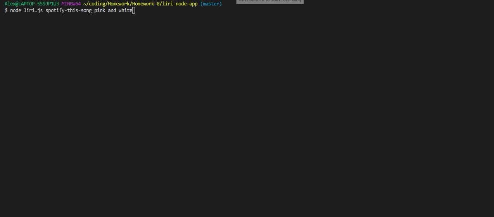
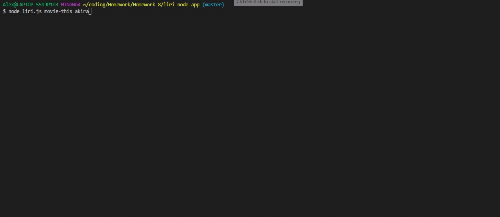
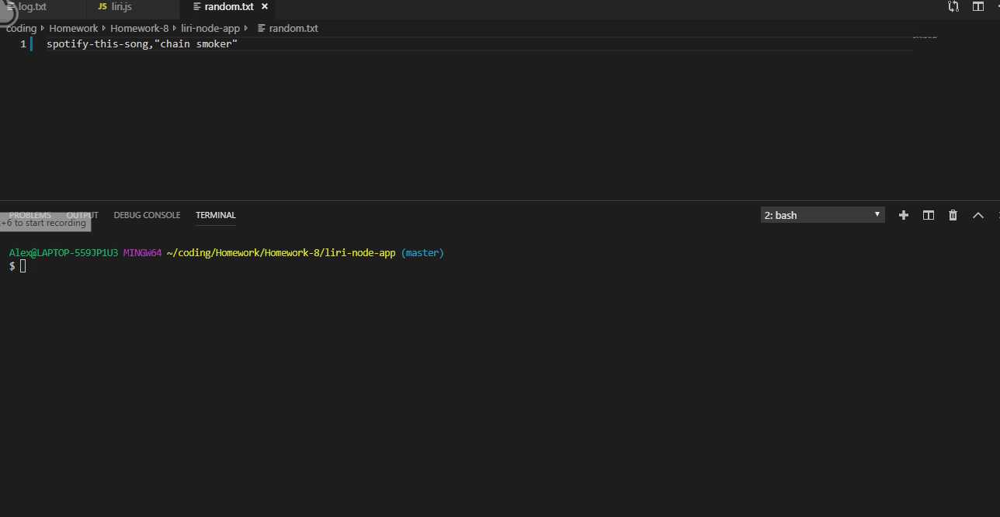
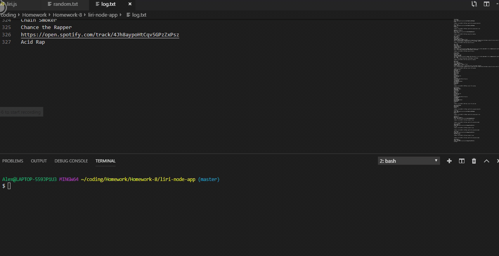
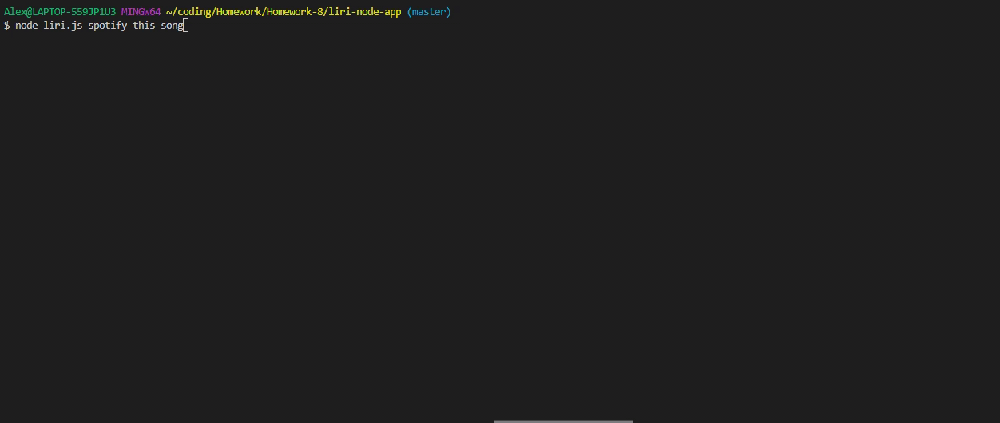

# liri-node-app

https://alexw519.github.io/liri-node-app/

This app is able to get infomation about upcoming concerts for an artist, song information from spotify, or movie infomation.

The user is able to pick between four commands: concert-this, spotify-this-song & movie-this. 

#### concert-this
The concert-this command pulls infomation from the Bands In Town API, and sends it to the console for each concert venue (up to 5). 
  * Name of the venue
  * Venue location
  * Date of the Event (use moment to format this as "MM/DD/YYYY")
  

 
#### spotify-this-song
The spotify-this-song command pulls information from the Spotify API and sends it the console. 
  * Artist(s)
  * The song's name
  * A preview link of the song from Spotify
  * The album that the song is from
If no search term is submitted, it will default to "The Sign" by Ace of Base. 

#### movie-this
The movie-this command will get infomation from the OMDB API, and send it to the console.
  * Title of the movie.
  * Year the movie came out.
  * IMDB Rating of the movie.
  * Rotten Tomatoes Rating of the movie.
  * Country where the movie was produced.
  * Language of the movie.
  * Plot of the movie.
  * Actors in the movie.
If no movie is provided, it will suggest watch Mr. Nobody

#### do-what-it-says
The do-what-it-says command reads the random.txt file and gets a command from there

## How To Run
The command to run the app is:
`node liri.js <searchType> <search>`
"searchType" has to be
  * concert-this
  * spotify-this-song
  * movie-this
  * do-what-it-says
 
If you don't do one of these commands a message will print out saying the command isn't recongized.
 
### Examples
"search" changes depending on which searchType that you use.
For concert-this "search" needs to be an artist/band name.

`node liri.js concert-this kid cudi`

For spotify-this-song "search" needs to be a song title.

`node liri.js spotify-this-song champion`

For movie-this "search" needs to be a movie title.

`node liri.js movie-this the lion king`

The last command that you can do is do-what-it-says. This command doesn't need a "search" term, it will be printed like the following.

`node liri.js do-what-it-says`

#### Logging Into The Log File

#### Empty Searches

## Technologies
Written in javascript, node.js.
Uses moment, axios & spotify packages
